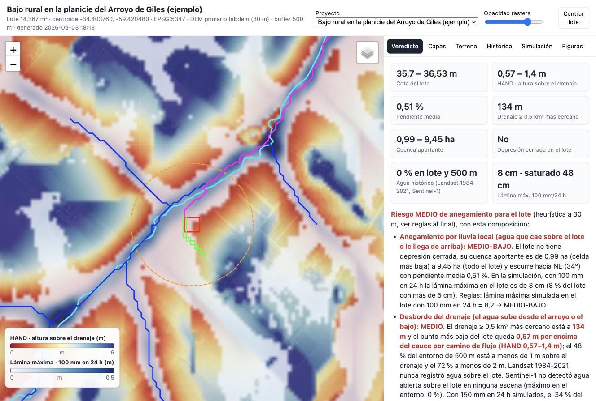

# anega2 · ¿se anega este lote?

Análisis reproducible de **riesgo de anegamiento por lluvia** para cualquier polígono KML en Argentina:
terreno (DEM, red de drenaje, HAND, depresiones, cuenca aportante), historial satelital de agua
(Landsat 1984-2021 y Sentinel-1 por evento), simulación lluvia → lámina de agua (rain-on-grid), informe
con veredicto por reglas, KML para Google Earth y un visor web. Todo con fuentes abiertas y **sin
cuentas** en ningún servicio. *English: [README.en.md](README.en.md).*

> anega2 es un diagnóstico regional a 30 m de píxel, sin calibración. Sirve para saber si un lote está en
> un alto, una ladera o un bajo, cuánto tendría que subir el agua para llegar, si el satélite lo vio
> inundado y qué pasaría con 100-200 mm de lluvia. **No reemplaza una nivelación en campo.**

## Instalación

```bash
git clone <este repo> anega2 && cd anega2
mamba env create -f environment.yml        # o conda; crea el env "anega2" e instala el paquete (-e .)
conda activate anega2
anega2 doctor                              # versiones, WhiteboxTools (baja su binario la primera vez) y acceso a las fuentes
```

Requiere Python ≥ 3.11, GDAL/rasterio/geopandas, WhiteboxTools (vía `whitebox`), Landlab. Probado en macOS (Apple Silicon) y Linux.

## Uso

```bash
anega2 init mi-lote --kml mi-lote.kml --titulo "Lote en ..."   # crea projects/mi-lote/project.yml
anega2 run mi-lote                                             # todas las fases (pide OK antes de descargas grandes; --si para no preguntar)
anega2 serve                                                   # abre el visor en http://localhost:8000/webapp/?project=mi-lote
```

Fases (`anega2 run <nombre> --fase ...`): `aoi` · `dem` · `terreno` · `agua` · `sar` · `lluvia` · `informe` · `kml` · `web`.
Cada fase reutiliza lo que ya está calculado. Un proyecto completo tarda entre 30 y 90 minutos según
la conexión (DEMs, ~10 escenas Sentinel-1) y el CPU (la simulación de lluvia es lo más lento).

El KML puede ser un polígono dibujado en Google Earth (un solo polígono; si hay varios se usa el más grande).
El CRS se elige solo (faja POSGAR 2007 por longitud; UTM fuera de Argentina). Radios, eventos de lluvia
a buscar en Sentinel-1, escenarios y parámetros de suelo se editan en `projects/<nombre>/project.yml`
(defaults comentados en `anega2/defaults.yml`).

## Qué produce (`projects/<nombre>/out/`)

| Archivo | Contenido |
|---|---|
| `README.md` | **Informe**: números clave, veredicto (BAJO / MEDIO-BAJO / MEDIO / ALTO para lluvia local y para desborde), limitaciones, qué chequear en campo y las reglas usadas |
| `<nombre>.kml` | KML único: lote, buffer, arroyos OSM, red de drenaje, cuenca aportante, camino de flujo, depresiones, HAND ≤ 1 / ≤ 2 m, manchas de agua simuladas |
| `terrain_stats.md`, `jrc_stats.md`, `sar_stats.md`, `rog_stats.md` | tablas por fase (también en CSV) |
| `10_terrain_*.png`, `20_jrc_*.png`, `30_sar_*.png`, `40_rog_*.png` | figuras con el lote superpuesto |
| `terrain_*_aoi.tif`, `jrc_*_aoi.tif`, `sar_*_aoi.tif`, `rog_*_aoi.tif` | GeoTIFF recortados al buffer de interés |
| `*.geojson` / `*.kml` | vectores (red, cuenca, camino de flujo, depresiones, HAND, manchas) |

El visor (`webapp/`) muestra todo eso sobre imagen satelital, con selector de escenas Sentinel-1 y de
escenarios de lluvia, y click en el mapa para leer cota, HAND, pendiente y lámina en cada punto.

## Cómo decide

1. **DEM**: baja IGN MDE-Ar 30 m (y 5 m si existe y se deja bajar), Copernicus GLO-30 y FABDEM; corre el
   análisis con todos y elige como primario el que mejor reproduce los arroyos de OpenStreetMap, con
   preferencia por FABDEM (terreno desnudo) porque los modelos de superficie ven las copas de los árboles
   y los techos del propio lote y lo hacen parecer una loma.
2. **Terreno** (WhiteboxTools): breach/fill, D8 y D∞, red de drenaje (0,5 y 2 km²), HAND, TWI, pendiente,
   depresiones cerradas (fill − DEM), cuenca aportante al lote, camino de flujo hasta el arroyo.
3. **Histórico**: JRC Global Surface Water (Landsat 1984-2021) y Sentinel-1 RTC de Planetary Computer
   alrededor de los eventos configurados (filtro Lee, umbral de Otsu o fijo, diferencia contra una referencia seca).
4. **Lluvia**: Landlab `OverlandFlow` con Green-Ampt sobre el DEM corregido, dominio de ±5 km, escenarios
   de 50/100/150/200 mm en 24 h y 60 mm en 2 h, más "suelo saturado". Sin IDF local, sin período de retorno.
5. **Veredicto**: reglas explícitas en `anega2/rules.yml` (HAND mínimo, depresiones, cuenca, agua vista por
   satélite, láminas simuladas). Se imprimen en el informe con los valores que las dispararon.

## Ejemplo

`projects/ejemplo-bajo-giles/` es un caso público corrido de punta a punta: un bajo rural de 1,4 ha en la
planicie de inundación del Arroyo de Giles (Buenos Aires), a 134 m del cauce y 0,6-1,4 m por encima de él.
Los satélites nunca lo vieron con agua, con 50 mm no pasa nada y con 100 mm apenas 8 cm en una esquina,
pero con 150 mm en 24 h el modelo pone 43 cm en un tercio del lote y con 200 mm, 76 cm en casi todo.
Veredicto: MEDIO. Ver `projects/ejemplo-bajo-giles/out/README.md`, la ficha `ficha_ejemplo-bajo-giles.pdf`,
y `anega2 serve` para recorrerlo en el visor.



(El ejemplo no incluye `data/` ni los GeoTIFF: se regeneran con `anega2 run ejemplo-bajo-giles`.)

## Limitaciones honestas

Píxel de 30 m (no ve zanjas, terraplenes ni alcantarillas), sin calibración, sin crecida del arroyo desde
fuera del dominio, Sentinel-1 no ve bajo árboles y pasa cada 6-12 días, escenarios sin recurrencia.
Los umbrales del veredicto son heurísticos: cambialos en `rules.yml` si tenés criterio local.

## Licencia y atribuciones

Código MIT. Los datos tienen sus licencias (ver [SOURCES.md](SOURCES.md)): en particular **FABDEM es
CC BY-NC-SA 4.0 (no comercial)**, Copernicus DEM y Sentinel requieren atribución, JRC y OSM también.
IGN: distribución libre y gratuita. Mapas base Esri sólo para visualización.

## Desarrollo

Paquete `anega2/` (`project.py` config y rutas, `common.py` helpers, un módulo por fase, `report.py` +
`rules.yml`, `cli.py`). Visor estático en `webapp/`. Diseño en `docs/superpowers/specs/`.
Notas de implementación: WhiteboxTools decodifica mal GeoTIFF float32 con deflate+predictor (los
intermedios se escriben sin compresión); su `RasterStreamsToVector` falla en macOS arm64 (la red se
vectoriza en Python desde el puntero D8); Landlab `OverlandFlow` necesita una película mínima de agua.
